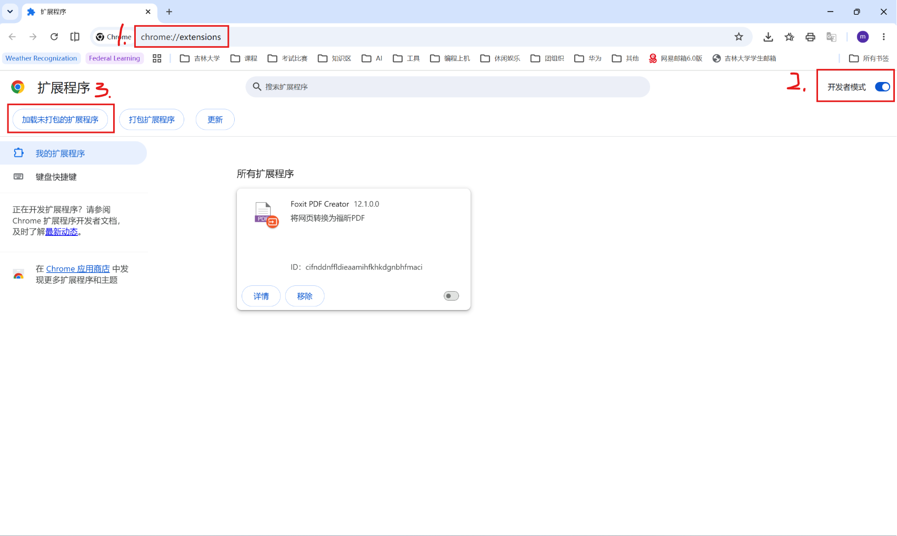
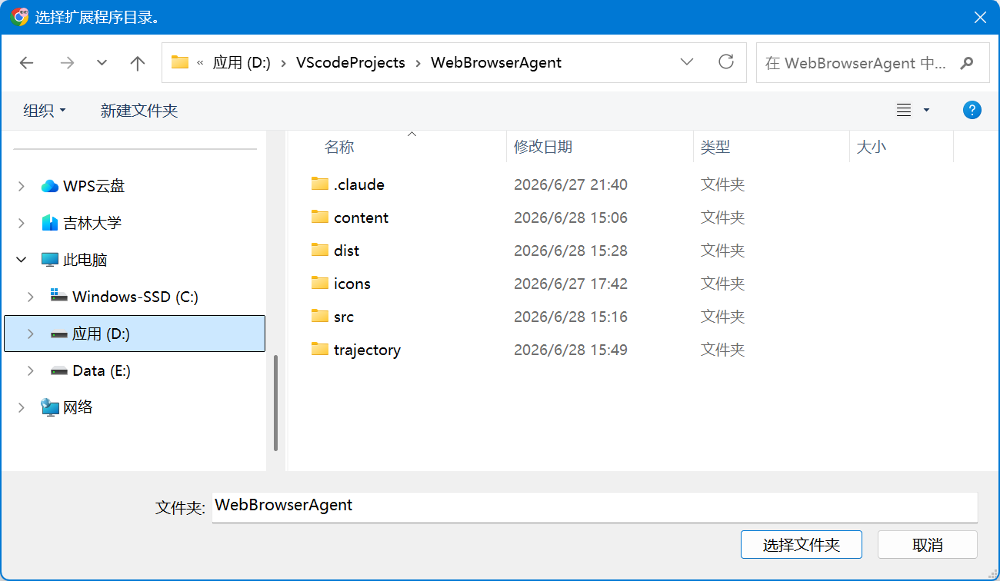
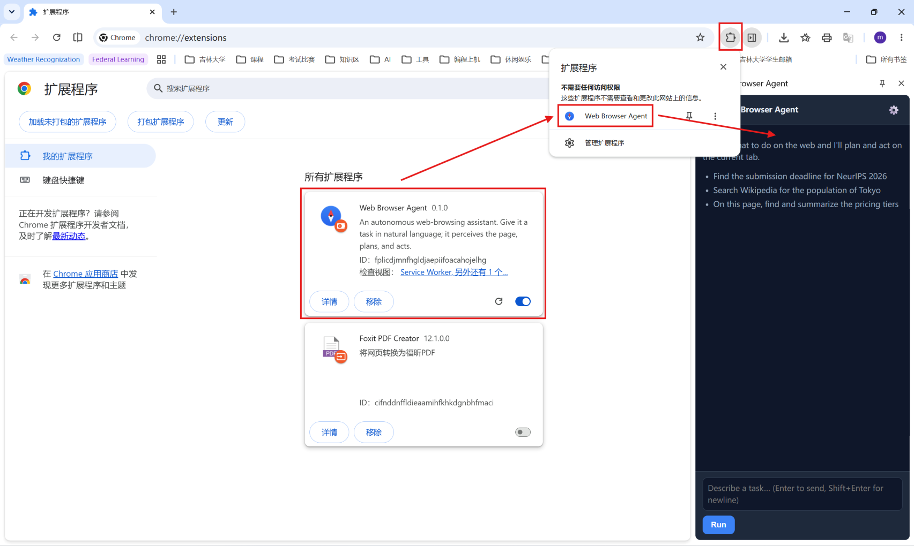
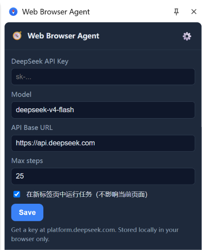
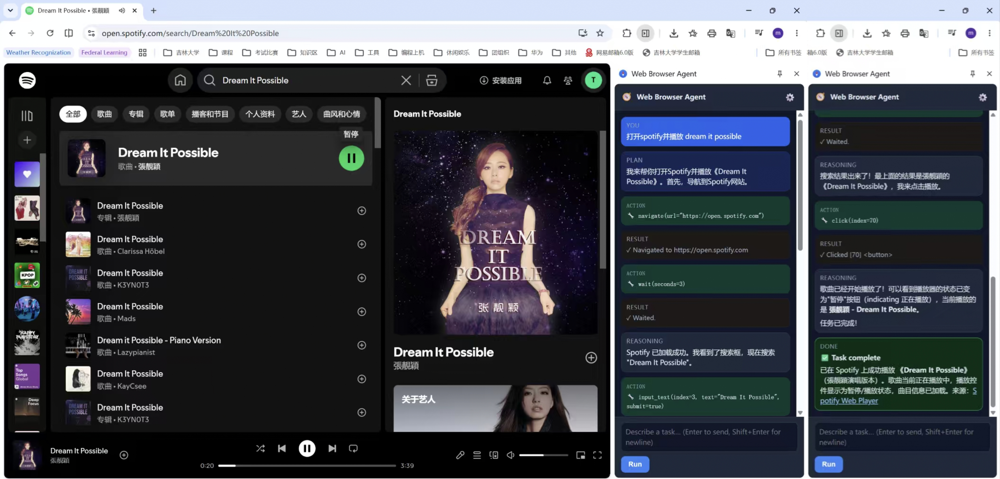

# 安装与运行说明（Demo）

Web Browser Agent 是一个 **Chrome 浏览器扩展**：用自然语言下达任务，Agent 会感知网页、自主规划、在页面上操作，并返回结果。它运行在用户的浏览器里，无需服务器。

## 一、环境要求

- **Chrome / Chromium / Edge 等 Chromium 内核浏览器，版本 ≥ 114**（侧边栏 API 需要）。
  - 查看版本：地址栏打开 `chrome://version`。
- 一个 **DeepSeek API Key**：在 https://platform.deepseek.com 注册获取。

## 二、获取扩展文件

下载生成的 ZIP ，**先解压**成一个文件夹（Chrome 不能直接加载 ZIP）。

## 三、加载扩展（开发者模式）

1. 地址栏打开 `chrome://extensions`。
2. 打开右上角 **开发者模式 / Developer mode**。
3. 点击 **加载未打包的扩展程序 / Load unpacked**。
4. 选择**刚刚解压的文件夹**（包含 `manifest.json` 的文件夹）。
5. 加载成功后，建议把扩展**固定**到工具栏。

## 四、首次配置

1. 点击工具栏的扩展图标 🧭，打开**侧边栏**。
2. 点右上角 ⚙️ 设置：
   - **DeepSeek API Key**：粘贴你的 key（只保存在本地浏览器 `chrome.storage.local`，不会上传别处）。
   - **Model**：默认 `deepseek-v4-flash`，可改成你账号支持的模型（如 `deepseek-chat`）。
   - **API Base URL**：默认 `https://api.deepseek.com`。
   - **Max steps**：单个任务最多步数（默认 25）。
   - **在新标签页中运行任务**：勾选则在新标签页执行、不打扰当前页；要操作「当前页面」请取消勾选（或在任务里写"在当前页面…"）。
3. 点 **Save**。
4. 再次点击 ⚙️ 即可关闭设置页面。

    

## 五、使用

1. 打开一个**普通网页**（`chrome://`、应用商店等受限页无法操作）。
2. 在侧边栏输入任务，按 **Run**（回车发送，Shift+回车换行）。可随时 **Stop**。

示例任务：
- 搜索 iPhone 17 Pro 的最新价格
- 在当前页面给 XXX 写一封邮件并保存到草稿箱中
- 打开 deepseek-api 官网并充值 10 元
- 打开飞书云文档中的算法学习笔记
- 查找最近的国际会议截稿日期并整理成列表

执行中你会看到：计划 → 每一步的动作/观察 → 最终结果。需要登录、被网站拦截、或要做不可逆操作（提交/支付/发送）时，会**弹窗让你确认或接管**。

## 六、常见问题

- **图标点了没反应 / 侧边栏打不开**：确认浏览器版本 ≥ 114；在 `chrome://extensions` 确认扩展已启用。
- **提示缺少 API Key**：到 ⚙️ 填入 DeepSeek key 并保存。
- **搜索没走默认引擎**：到 `chrome://extensions` 把扩展关掉再打开（新增的 `search` 权限需重新授予）；并确认 `chrome://settings/search` 的默认引擎。
- **受限页报"无法访问"**：`chrome://`、Chrome 网上应用店等页面无法注入脚本，换一个普通网站即可（任务不会因此中断）。
- **DeepSeek 报 4xx**：检查 Model 名称、Base URL、key 是否正确、账户额度是否充足。
